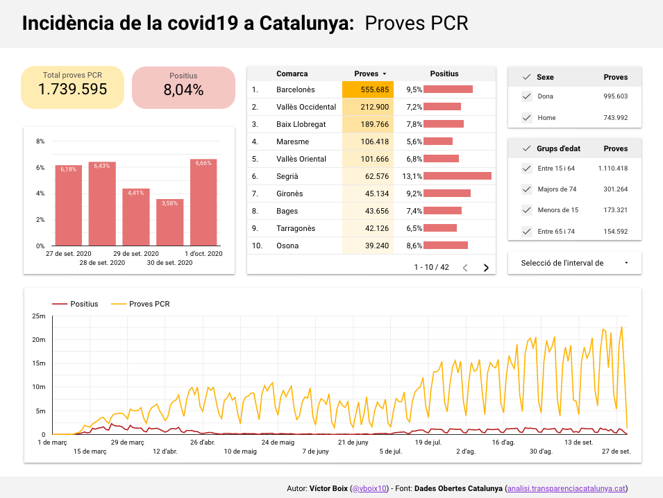

# Incidència de la covid19 a Catalunya

Visualització de les dades diàries de positius, proves PCR, percentatge d'infectats i defuncions per comarca, sexe i grup d'edat

## Visualització

## Font de dades

* [Dades Obertes Catalunya: Dades diàries de covid19 per comarca](https://analisi.transparenciacatalunya.cat/Salut/Dades-di%C3%A0ries-de-COVID-19-per-comarca/c7sd-zy9j)

## Codi

* [Script d'actualització de les dades](DataUpdate.py)
